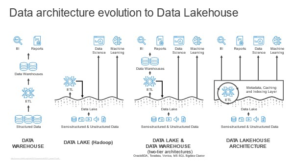

# hello_dbms
---
Les données constituent le fondement essentiel de l'informatique et de l'intelligence artificielle. Elles représentent des informations brutes qui, selon leur nature, peuvent être traitées de différentes manières. La compréhension des diverses formes de données est cruciale.Elle peut se présenter sous différentes formes, notamment : 

1. **Numérique :** Les données numériques se présentent sous forme de valeurs chiffrées, essentielles pour les calculs mathématiques et statistiques.

2. **Textuelle :** Les données textuelles comprennent des caractères alphabétiques ou des mots, souvent utilisées pour représenter des informations littéraires.

3. **Date/Heure :** Les informations temporelles, telles que les dates et les heures, sont cruciales pour les analyses temporelles et la gestion chronologique des données.

4. **Booléenne :** Les données booléennes ont une valeur binaire, soit vrai (True) soit faux (False), et sont fondamentales pour les évaluations conditionnelles.

5. **Image :** Les données visuelles, telles que les graphiques et les images, sont utilisées pour représenter des informations de manière graphique.

6. **Audio :** Les données sonores sont des enregistrements audio, souvent exploitées dans des domaines tels que la reconnaissance vocale.

7. **Texte structuré :** Ces données sont organisées dans des formats structurés comme les tableaux, bases de données ou fichiers CSV, facilitant la manipulation et l'analyse.

8. **Géographique :** Les données géographiques incluent des coordonnées ou des informations liées à des emplacements, cruciales dans les applications cartographiques.

9. **Réseaux :** Les données de réseau sont liées aux connexions et aux relations, utilisées dans les contextes des réseaux sociaux ou des graphes.

10. **Code :** Les instructions ou scripts informatiques, écrits dans des langages de programmation, sont essentiels pour automatiser les processus.

En conclusion, la diversité des formes de données reflète la complexité du monde informatique, et la maîtrise de ces différentes formes est fondamentale pour des analyses et des applications informatiques efficaces.
---

La qualité des données est essentielle pour garantir la fiabilité et l'efficacité des processus liés à l'analyse et à la gestion des données. Voici quelques critères de mesure de la qualité des données :

1. **Exactitude :** La précision des données par rapport à la réalité. Des données exactes sont sans erreurs et reflètent fidèlement les faits qu'elles représentent.

2. **Complétude :** L'étendue des données par rapport à ce qui était prévu. Des données complètes couvrent toutes les informations nécessaires sans omissions.

3. **Cohérence :** L'harmonisation des données à travers différentes sources ou ensembles de données. Des données cohérentes ne présentent pas de contradictions internes.

4. **Actualité :** La pertinence temporelle des données. Des données à jour sont cruciales pour des analyses et des décisions actuelles.

5. **Fiabilité :** La confiance dans l'origine et la précision des données. Des données fiables sont issues de sources crédibles et sont de qualité vérifiable.

6. **Intégrité :** La préservation de la structure et de la relation des données. Des données intègres ne sont pas altérées et conservent leur cohérence structurelle.

7. **Précision :** La granularité et le niveau de détail des données. Des données précises sont suffisamment détaillées pour répondre aux besoins spécifiques.

8. **Accessibilité :** La facilité avec laquelle les données peuvent être récupérées et utilisées. Des données accessibles sont disponibles quand et où elles sont nécessaires.

9. **Conformité :** L'adhésion aux normes et réglementations en vigueur. Des données conformes respectent les exigences légales et normatives.

10. **Sécurité :** La protection des données contre tout accès non autorisé. Des données sécurisées garantissent la confidentialité et l'intégrité.

L'évaluation de la qualité des données à travers ces critères est cruciale pour assurer une utilisation efficace et fiable des données dans les processus décisionnels et opérationnels.
---

Les concepts de Data Lake, Data Warehouse et Lake House sont tous liés à la gestion et à l'analyse de grandes quantités de données, mais ils diffèrent dans leurs approches et leurs fonctionnalités.

1. **Data Lake :**
   - *Définition :* Un Data Lake est un référentiel de stockage centralisé qui permet de stocker des données brutes et non transformées à grande échelle.
   - *Caractéristiques :* Il peut stocker tous types de données, structurées ou non structurées. Il offre une flexibilité maximale pour l'exploration des données.
   - *Schéma :* 

2. **Data Warehouse :**
   - *Définition :* Un Data Warehouse est une base de données centralisée qui stocke des données structurées, transformées et optimisées pour l'analyse.
   - *Caractéristiques :* Il est axé sur la performance et la prise de décision. Les données y sont organisées en schémas prédéfinis pour des requêtes analytiques rapides.
   - *Schéma :* 

3. **Lake House :**
   - *Définition :* Un Lake House combine des aspects du Data Lake et du Data Warehouse, offrant la flexibilité du stockage brut avec la puissance de traitement analytique.
   - *Caractéristiques :* Il permet de stocker des données brutes dans un environnement centralisé tout en fournissant des capacités d'analyse avancées.
   - *Schéma :* 

**Comparaison :**
   
   | Critère | Data Lake | Data Warehouse | Lake House |
   |---------|------------|-----------------|------------|
   | **Type de Données** | Toutes les formes (brutes) | Principalement structurées | Toutes les formes (brutes et transformées) |
   | **Flexibilité** | Très élevée | Moindre | Élevée |
   | **Performance Analytique** | Variable | Élevée | Élevée |
   | **Schéma des Données** | Non structuré | Structuré | Semi-structuré |
   | **Objectif Principal** | Stockage à grande échelle | Analyse performante | Combinaison de stockage et d'analyse avancée |

En résumé, chacun de ces concepts a ses avantages et ses cas d'utilisation spécifiques. Un Data Lake offre une grande flexibilité de stockage, un Data Warehouse se concentre sur la performance analytique, tandis qu'un Lake House tente de combiner le meilleur des deux mondes en offrant la flexibilité du stockage brut et la puissance du traitement analytique.
---

Un Système de Gestion de Bases de Données (SGBD) est un logiciel qui facilite la création, la gestion, la maintenance et l'utilisation de bases de données. Il offre une interface pour interagir avec les données de manière organisée et sécurisée. Voici quelques exemples de Systèmes de Gestion de Bases de Données avec des illustrations :

1. **MySQL :**
   - *Définition :* MySQL est un SGBD open source très populaire, largement utilisé pour les applications web.
   - *Exemple d'Illustration :* 

2. **Microsoft SQL Server :**
   - *Définition :* SQL Server est un SGBD développé par Microsoft, reconnu pour ses performances et sa sécurité.
   - *Exemple d'Illustration :* 

3. **Oracle Database :**
   - *Définition :* Oracle Database est un SGBD leader du marché, robuste et adapté aux grandes entreprises.
   - *Exemple d'Illustration :* 

4. **PostgreSQL :**
   - *Définition :* PostgreSQL est un SGBD open source avec un accent sur l'extensibilité et la conformité aux normes.
   - *Exemple d'Illustration :* 

5. **MongoDB :**
   - *Définition :* MongoDB est une base de données NoSQL orientée document, adaptée au stockage de données non structurées.
   - *Exemple d'Illustration :* 

**Comparaison des Illustrations :**

   | SGBD | Exemple d'Illustration |
   |------|------------------------|
   | **MySQL** |  |
   | **SQL Server** |  |
   | **Oracle Database** |  |
   | **PostgreSQL** |  |
   | **MongoDB** |  |

Ces Systèmes de Gestion de Bases de Données offrent des fonctionnalités diverses pour répondre aux besoins spécifiques des applications, qu'il s'agisse de données relationnelles, de données NoSQL ou d'autres formes de stockage de données.
---


**Base de Données Relationnelle :**
- *Définition :* Une base de données relationnelle est un type de base de données qui organise les données en tables interconnectées avec des relations définies entre elles. Elle utilise le langage SQL (Structured Query Language) pour interagir avec les données.
- *Exemple d'Application :* Systèmes de gestion de bases de données relationnelles tels que MySQL, PostgreSQL, Microsoft SQL Server.
- *Différence :* Les données sont structurées en tables avec des lignes et des colonnes, suivant un schéma préalablement défini.

**Base de Données Non Relationnelle :**
- *Définition :* Une base de données non relationnelle, également appelée NoSQL, est un type de base de données qui n'utilise pas le modèle tabulaire des bases de données relationnelles. Elle offre une flexibilité accrue pour le stockage de données non structurées ou semi-structurées.
- *Exemple d'Application :* MongoDB (base de données orientée document), Cassandra (base de données orientée colonne), Redis (base de données clé-valeur).
- *Différence :* Les données peuvent être stockées de manière flexible, souvent sans schéma fixe, permettant une évolution plus dynamique des structures de données.

**Comparaison :**

   | Critère | Base de Données Relationnelle | Base de Données Non Relationnelle |
   |---------|------------------------------|-----------------------------------|
   | **Structure des Données** | Tables interconnectées | Flexibilité dans le stockage des données |
   | **Langage d'Interrogation** | SQL | Divers langages selon le type de NoSQL |
   | **Schéma** | Schéma fixe préalablement défini | Souvent sans schéma fixe, ou avec un schéma dynamique |
   | **Applications Courantes** | Systèmes ERP, CRM, applications transactionnelles | Applications web évolutives, Big Data, IoT |

En résumé, les bases de données relationnelles sont structurées de manière tabulaire avec des relations définies, idéales pour des applications transactionnelles. Les bases de données non relationnelles offrent une flexibilité accrue, adaptées aux applications nécessitant une évolution dynamique des structures de données, comme les applications web modernes, le Big Data et l'IoT.
---

**F. Définissez les notions de clé étrangère et clé primaire.**

- **Clé Primaire :**
  - *Définition :* Une clé primaire est un attribut ou un ensemble d'attributs qui identifie de manière unique chaque enregistrement dans une table d'une base de données relationnelle. Chaque table ne peut avoir qu'une seule clé primaire.
  - *Exemple :* Dans une table "Utilisateurs," l'attribut "ID Utilisateur" peut être défini comme clé primaire, garantissant que chaque utilisateur a un identifiant unique.

- **Clé Étrangère :**
  - *Définition :* Une clé étrangère est un attribut ou un ensemble d'attributs dans une table qui fait référence à la clé primaire d'une autre table. Elle établit une relation entre deux tables, permettant de lier les données.
  - *Exemple :* Dans une table "Commandes," l'attribut "ID Utilisateur" peut être défini comme clé étrangère faisant référence à la clé primaire "ID Utilisateur" de la table "Utilisateurs."

**Utilité :**

- La **clé primaire** garantit l'unicité des enregistrements dans une table, facilitant l'identification et la recherche de données spécifiques.

- La **clé étrangère** permet d'établir des relations entre les tables, assurant l'intégrité référentielle et la cohérence des données entre les différentes entités.

La clé primaire identifie de manière unique les enregistrements dans une table, tandis que la clé étrangère établit des liens entre les tables pour maintenir l'intégrité référentielle dans une base de données relationnelle.
---

Les propriétés ACID sont un ensemble de caractéristiques qui garantissent la fiabilité et la cohérence des transactions dans une base de données. Chaque lettre d'ACID représente une propriété spécifique :

1. **Atomicité (Atomicity) :**
   - Une transaction est une opération unique qui est soit entièrement exécutée, soit entièrement annulée en cas d'échec. Il n'y a pas d'état intermédiaire.

2. **Cohérence (Consistency) :**
   - Une transaction amène la base de données d'un état valide à un autre. La base de données reste dans un état cohérent avant et après l'exécution de la transaction.

3. **Isolation (Isolation) :**
   - Les transactions s'exécutent de manière isolée les unes des autres, de sorte que l'effet d'une transaction n'est pas visible par les autres transactions en cours. Cela prévient les conflits d'accès concurrents.

4. **Durabilité (Durability) :**
   - Une fois qu'une transaction est confirmée, ses modifications sont permanentes et survivent aux pannes du système. Les données modifiées sont persistantes même en cas de panne.

Ces propriétés ACID sont essentielles pour garantir la stabilité et la fiabilité des transactions dans un environnement de base de données, assurant l'intégrité des données même en cas d'événements imprévus ou d'échecs.
---
1. **Méthode Merise :**
   - *Définition :* Merise est une méthode d'analyse, de conception et de gestion de projets informatiques. Elle utilise des concepts tels que les modèles entité-association et les modèles conceptuels pour représenter les données, les traitements et les flux d'information dans un système.
   - *Utilité :* Merise est principalement utilisé pour concevoir des systèmes d'information en se concentrant sur la structuration des données et des processus métier.
   - *Cas d'Utilisation :* La modélisation d'une base de données avec Merise, où l'on représente les entités, les relations et les cardinalités à l'aide de diagrammes entité-association.

   

2. **UML (Unified Modeling Language) :**
   - *Définition :* UML est un langage de modélisation graphique standardisé utilisé pour visualiser, spécifier, construire et documenter les systèmes logiciels. Il offre une notation graphique pour représenter divers aspects d'un système.
   - *Utilité :* UML est largement utilisé pour modéliser les aspects conceptuels, structurels et comportementaux des logiciels, facilitant la communication et la compréhension entre les membres de l'équipe de développement.
   - *Cas d'Utilisation :* La modélisation d'un diagramme de classes UML pour représenter les classes, les relations, les attributs et les méthodes dans un système orienté objet.

   

**Utilité dans le Monde de l'Informatique :**
   - Merise est utilisé dans la phase d'analyse et de conception des systèmes d'information, en mettant l'accent sur la modélisation des données.
   - UML est utilisé tout au long du cycle de vie du développement logiciel, de la spécification initiale à la conception détaillée et à la documentation.

**Résumé :**
   - Merise se concentre sur la modélisation des données et des traitements dans les systèmes d'information.
   - UML fournit une notation standardisée pour la modélisation des aspects conceptuels, structurels et comportementaux des systèmes logiciels.

Ces méthodes jouent un rôle essentiel dans le développement de logiciels en fournissant des moyens visuels et structurés pour représenter et comprendre les différents aspects d'un système informatique.
---

I apologize for the oversight. Let me provide the translations and responses following the established strategy.

**I. Define the SQL language. Provide the most commonly used commands in this language and the different types of joins that can be performed.**
---

Le langage SQL (Structured Query Language) est un langage de programmation standardisé utilisé pour gérer et manipuler des bases de données relationnelles. Il offre un ensemble de commandes permettant d'effectuer des opérations telles que la création, la modification et la récupération de données dans une base de données.

**Commandes SQL les Plus Utilisées :**

1. **SELECT :** Utilisé pour récupérer des données d'une ou plusieurs tables.

   ```sql
   SELECT * FROM employes WHERE service = 'Ventes';
   ```

2. **INSERT :** Ajoute une nouvelle ligne de données dans une table.

   ```sql
   INSERT INTO clients (nom, prenom, email) VALUES ('Doe', 'John', 'john.doe@email.com');
   ```

3. **UPDATE :** Modifie des données existantes dans une table.

   ```sql
   UPDATE produits SET prix = 25.99 WHERE id_produit = 123;
   ```

4. **DELETE :** Supprime des lignes de données d'une table.

   ```sql
   DELETE FROM commandes WHERE date < '2022-01-01';
   ```

5. **CREATE :** Crée une nouvelle table, vue, index, etc.

   ```sql
   CREATE TABLE employes (id_employee INT, nom VARCHAR(50), service VARCHAR(50));
   ```

**Différentes Jointures :**

Les jointures SQL sont utilisées pour combiner des lignes de deux ou plusieurs tables basées sur une condition de relation entre elles. Les types de jointures courants sont :

1. **INNER JOIN :** Retourne les lignes lorsque des correspondances sont trouvées dans les deux tables.

   ```sql
   SELECT employes.nom, commandes.numero
   FROM employes
   INNER JOIN commandes ON employes.id_employee = commandes.id_employee;
   ```

2. **LEFT (OUTER) JOIN :** Retourne toutes les lignes de la table de gauche et les lignes correspondantes de la table de droite.

   ```sql
   SELECT clients.nom, commandes.numero
   FROM clients
   LEFT JOIN commandes ON clients.id_client = commandes.id_client;
   ```

3. **RIGHT (OUTER) JOIN :** Retourne toutes les lignes de la table de droite et les lignes correspondantes de la table de gauche.

   ```sql
   SELECT employes.nom, commandes.numero
   FROM employes
   RIGHT JOIN commandes ON employes.id_employee = commandes.id_employee;
   ```

4. **FULL (OUTER) JOIN :** Retourne toutes les lignes lorsque des correspondances sont trouvées dans l'une des tables.

   ```sql
   SELECT clients.nom, commandes.numero
   FROM clients
   FULL JOIN commandes ON clients.id_client = commandes.id_client;
   ```

Les jointures SQL sont essentielles pour récupérer des données liées à partir de plusieurs tables dans une base de données relationnelle.
---