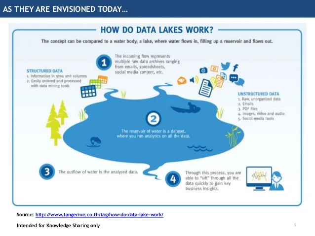
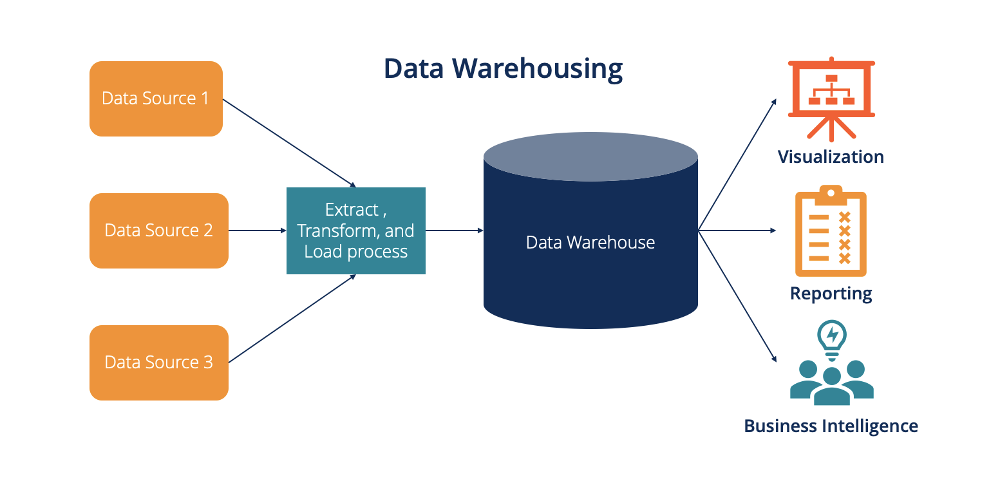

# hello_dbms

Les données constituent le fondement essentiel de l'informatique et de l'intelligence artificielle. Elles représentent des informations brutes qui, selon leur nature, peuvent être traitées de différentes manières. La compréhension des diverses formes de données est cruciale.Elle peut se présenter sous différentes formes, notamment : 

1. **Numérique :** Les données numériques se présentent sous forme de valeurs chiffrées, essentielles pour les calculs mathématiques et statistiques.

2. **Textuelle :** Les données textuelles comprennent des caractères alphabétiques ou des mots, souvent utilisées pour représenter des informations littéraires.

3. **Date/Heure :** Les informations temporelles, telles que les dates et les heures, sont cruciales pour les analyses temporelles et la gestion chronologique des données.

4. **Booléenne :** Les données booléennes ont une valeur binaire, soit vrai (True) soit faux (False), et sont fondamentales pour les évaluations conditionnelles.

5. **Image :** Les données visuelles, telles que les graphiques et les images, sont utilisées pour représenter des informations de manière graphique.

6. **Audio :** Les données sonores sont des enregistrements audio, souvent exploitées dans des domaines tels que la reconnaissance vocale.

7. **Texte structuré :** Ces données sont organisées dans des formats structurés comme les tableaux, bases de données ou fichiers CSV, facilitant la manipulation et l'analyse.

8. **Géographique :** Les données géographiques incluent des coordonnées ou des informations liées à des emplacements, cruciales dans les applications cartographiques.

9. **Réseaux :** Les données de réseau sont liées aux connexions et aux relations, utilisées dans les contextes des réseaux sociaux ou des graphes.

10. **Code :** Les instructions ou scripts informatiques, écrits dans des langages de programmation, sont essentiels pour automatiser les processus.

En conclusion, la diversité des formes de données reflète la complexité du monde informatique, et la maîtrise de ces différentes formes est fondamentale pour des analyses et des applications informatiques efficaces.

**B. Donnez et expliquez les critères de mesure de qualité des données.**

---
La qualité des données est essentielle pour garantir la fiabilité et l'efficacité des processus liés à l'analyse et à la gestion des données. Voici quelques critères de mesure de la qualité des données :

1. **Exactitude :** La précision des données par rapport à la réalité. Des données exactes sont sans erreurs et reflètent fidèlement les faits qu'elles représentent.

2. **Complétude :** L'étendue des données par rapport à ce qui était prévu. Des données complètes couvrent toutes les informations nécessaires sans omissions.

3. **Cohérence :** L'harmonisation des données à travers différentes sources ou ensembles de données. Des données cohérentes ne présentent pas de contradictions internes.

4. **Actualité :** La pertinence temporelle des données. Des données à jour sont cruciales pour des analyses et des décisions actuelles.

5. **Fiabilité :** La confiance dans l'origine et la précision des données. Des données fiables sont issues de sources crédibles et sont de qualité vérifiable.

6. **Intégrité :** La préservation de la structure et de la relation des données. Des données intègres ne sont pas altérées et conservent leur cohérence structurelle.

7. **Précision :** La granularité et le niveau de détail des données. Des données précises sont suffisamment détaillées pour répondre aux besoins spécifiques.

8. **Accessibilité :** La facilité avec laquelle les données peuvent être récupérées et utilisées. Des données accessibles sont disponibles quand et où elles sont nécessaires.

9. **Conformité :** L'adhésion aux normes et réglementations en vigueur. Des données conformes respectent les exigences légales et normatives.

10. **Sécurité :** La protection des données contre tout accès non autorisé. Des données sécurisées garantissent la confidentialité et l'intégrité.

L'évaluation de la qualité des données à travers ces critères est cruciale pour assurer une utilisation efficace et fiable des données dans les processus décisionnels et opérationnels.
---

**C. Définissez et comparez les notions de Data Lake, Data Warehouse et Lake House. Illustrez les différences à l’aide de schémas.**

Les concepts de Data Lake, Data Warehouse et Lake House sont tous liés à la gestion et à l'analyse de grandes quantités de données, mais ils diffèrent dans leurs approches et leurs fonctionnalités.

1. **Data Lake :**
   - *Définition :* Un Data Lake est un référentiel de stockage centralisé qui permet de stocker des données brutes et non transformées à grande échelle.
   - *Caractéristiques :* Il peut stocker tous types de données, structurées ou non structurées. Il offre une flexibilité maximale pour l'exploration des données.
   - *Schéma :* 

2. **Data Warehouse :**
   - *Définition :* Un Data Warehouse est une base de données centralisée qui stocke des données structurées, transformées et optimisées pour l'analyse.
   - *Caractéristiques :* Il est axé sur la performance et la prise de décision. Les données y sont organisées en schémas prédéfinis pour des requêtes analytiques rapides.
   - *Schéma :* 

3. **Lake House :**
   - *Définition :* Un Lake House combine des aspects du Data Lake et du Data Warehouse, offrant la flexibilité du stockage brut avec la puissance de traitement analytique.
   - *Caractéristiques :* Il permet de stocker des données brutes dans un environnement centralisé tout en fournissant des capacités d'analyse avancées.
   - *Schéma :* 

**Comparaison :**
   
   | Critère | Data Lake | Data Warehouse | Lake House |
   |---------|------------|-----------------|------------|
   | **Type de Données** | Toutes les formes (brutes) | Principalement structurées | Toutes les formes (brutes et transformées) |
   | **Flexibilité** | Très élevée | Moindre | Élevée |
   | **Performance Analytique** | Variable | Élevée | Élevée |
   | **Schéma des Données** | Non structuré | Structuré | Semi-structuré |
   | **Objectif Principal** | Stockage à grande échelle | Analyse performante | Combinaison de stockage et d'analyse avancée |

En résumé, chacun de ces concepts a ses avantages et ses cas d'utilisation spécifiques. Un Data Lake offre une grande flexibilité de stockage, un Data Warehouse se concentre sur la performance analytique, tandis qu'un Lake House tente de combiner le meilleur des deux mondes en offrant la flexibilité du stockage brut et la puissance du traitement analytique.

